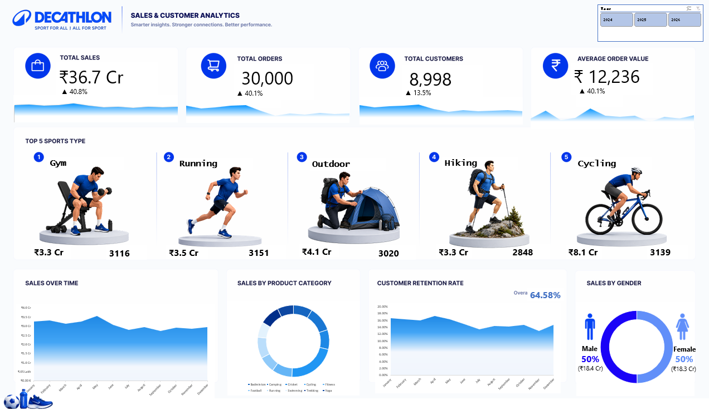

# 🏀 Decathlon Dashboard — Sales & Customer Analytics

An interactive **Microsoft Excel Dashboard** built for **Decathlon**, delivering smarter insights into sales performance, customer behavior, and product trends across years — helping the business build stronger connections and better performance.

🔗 **Repository:** [Decathlon-Sales-Customer-Analytics-Dashboard-Excel](https://github.com/niharikakt024/Decathlon-Sales-Customer-Analytics-Dashboard-Excel)

---

## 🖥️ Dashboard Preview

A single-page executive view combining top-line KPIs, top-performing sports categories, and trend/behavioral breakdowns, filterable by year (2024–2026).



---

## ✨ Key Features

- **Year Filter** — Toggle between 2024, 2025, and 2026
- **KPI Cards** — Total Sales, Total Orders, Total Customers, and Average Order Value, each with YoY growth %
- **Top 5 Sports Type** — Ranked view of best-performing categories (Gym, Running, Outdoor, Hiking, Cycling) with sales value and order count
- **Sales Over Time** — Monthly sales trend across the year
- **Sales by Product Category** — Donut breakdown across categories like Badminton, Camping, Cricket, Cycling, Fitness, Football, Running, Swimming, Trekking, and Yoga
- **Customer Retention Rate** — Monthly retention trend with overall retention %
- **Sales by Gender** — Male vs. Female revenue split

---

## 🛠️ Tech Stack

- **Tool:** Microsoft Excel
- **Data Modeling:** Star schema with sales, customer, product, and date dimension tables
- **DAX:** Custom measures for YoY growth %, retention rate, and category-wise contribution
- **Data Source:** Sales, order, and customer transactional data

---

## 📁 Repository Structure

```
DECATHLON-DASHBOARD/
│
├── Decethlon Dashboard.xlsx          # Excel dashboard file
├── Dataset.xlsx                   # Source data files (if included)
├── Decathlon dashboard.png            # Dashboard preview images
└── README.md                # Project documentation
```

---

## 🚀 Getting Started

1. Clone the repository
   ```bash
   git clone https://github.com/niharikakt024/Decathlon-Sales-Customer-Analytics-Dashboard-Excel.git
   ```
2. Open the `.xlsx` file in **Microsoft Excel**
3. Refresh the data source (if connected to live data)
4. Use the year filter to explore performance across 2024, 2025, and 2026

---

## 📈 Key Insights

- Total sales reached **₹36.7 Cr**, up **40.8%**, driven by strong growth across all top KPIs
- **Cycling** is the highest-revenue sports category (**₹8.1 Cr**) despite not having the highest order count, suggesting a higher average order value in this segment
- **Gym** leads in order volume among top categories, closely followed by Running and Cycling
- Customer base grew to **8,998**, with overall retention holding steady at **64.58%**
- Revenue is evenly split by gender, with Male and Female customers each contributing **50%** of sales

---


## 👨‍💻 Author
Niharika K T

Aspiring Data Analyst | Power BI | SQL | Excel | Python | Data Visualization

📧 Email: niharikakt024@gmail.com
🔗 LinkedIn: www.linkedin.com/in/niharika-k-t-8a1a2728a
💻 GitHub: https://github.com/niharikakt024

⭐ If you find this project useful, consider giving the repository a star!
